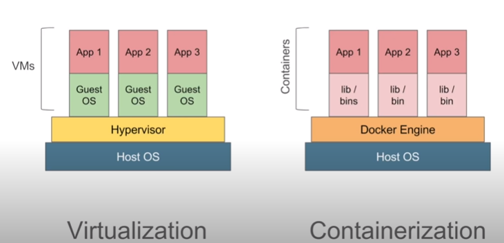

# More about Dockers

## Docker Basics

* Portability - Same working on different platforms and devices.

* Docker is used throughtout the SDLC Lifecycle but its most important significance plays in deployment.

* Software Stack - A software consists of 
1. Frontend
2. Backend
3. Database
4. Dependencies and Environment configurations
We have to configure all of them in different environments to run it everywhere.

* Containers are standard packaging - organization - transport - portability.

## Docker Architecture

### General Workflow of Docker

* Dockerfile - Docker Image - Docker Container - DockerHub
* Pull Image in different devices via the repository and run the container anywhere.

### Containerization vs Virtualization

* Hypervisor vs Container Runtime
* Guest OS vs Parent Kernel sharing
* Resource allocation vs On demand resource allocation

### Docker Architecture - Client Server Architecture

* Client - Command Line Interface
* Server - Docker Daemon - containers run on server => Server = Docker Daemon + Containers
* Docker Engine - Client + Server
* Docker Client and Server interact via commands or Rest API.

## Advantages of Docker
* Build Once - Run everywhere
* Portable - Supported by AWS, GCP etc
* Easy to Share - central hub repository
* Version Controlling
* Isolation
* Standard Packaging 
* Improved productivity

