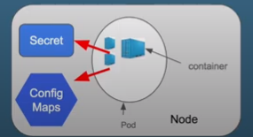
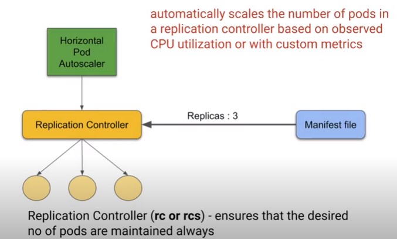

# Kubernetes 101

## Introduction

* Greek word Kubernetes - Helmsman - Orchestrator
* K8s - 8 characters between K and S in Kubernetes

### What is Kubernetes
* Container Management / Orchestration tool
* Developed by Google
* Managed by CNCF
* Open Source
* Written in Golang
 

### What is Container Orchestration Engine

* **Container Management/Orchestration Tool:** It is used to automate the deploying, scaling and management of containers or group of containers.

**CMS Tools Example:**
1. Kubernetes
2. Apache Mesos Marathon
3. Docker Swarm

**CMS Manages:**
1. Deployment
2. Scheduling
3. Scaling
4. Load Balancing

### Why Kubernetes
* Different management needs of CMS
1. Deployment
2. Scheduling
3. Scaling
4. Load Balancing
5. Batch execution
6. Rollbacks
7. Monitoring

* Organizing large number of containers

## Features of Kubernetes

### 1. Automatic Bin Packing

* Servers are also called as bins.
* We have to optimize the packing of software on servers in most efficient way.
* Automated packing and scheduling based on specified requirements and resources available.

**Pods:** Collection of containers

* Kuberenetes does not have direct communication with container
* Kubernetes wraps container or group of them in a pod.
* Pod or group of pods are stored on node.

**Nodes:** Working or Master device. Pods run on nodes.

* We can specify the reosources needed for pods and containers and these specifications are used by Kubernetes for better packing.

### 2. Service Discovery and Load Balancing

* **Pods:** Consists of
1. application container(s)
2. volumes
3. Unique IP

* **Services:** Collection of related Pods in a higher-level wrapping.
Uniquely identified by DNS name.
**Services can consist of replica of same pod which can be used for load balancing.**
Services are used for Network and communication.

### 3. Storage Orchestration**

* Volume definition inside pods.
* One volume for one pod
* Volume can be:
1. Docker volume
2. Local Storage
3. Cloud storage
4. Network Storage (NFS)

### 4. Self-Healing

**Self Healing done by Replication Controller**
* If container fails - restart container
* If node dies - replace and reschedule containers on other nodes
* If container does not respond to health check - Kill the container and use alternate container

### 5. Automated Rollouts and Rollbacks

**Rollout:** Deploy changes to the application or its configuration

**Rollback** Revert the changes and restore to previous stable state.

* Kubernetes does automated rollout and rollback, that too by guarenteeing **ZERO DOWNTIME**

### 6. Secret and Configuration Management

**Special Kubernetes Objects: Difference between them - Isolation from containers**
1. Secrets
2. Config Maps

1. Secrets
* Sensitive data
* Managed and created outside pods but in same node
* Makes sensitive data portable and easy to manage

2. ConfigMaps
* configuration
* Managed and created outside pods but in same node
* Makes configurations portable and easy to manage

**Notes:**

* Special Kubernetes objects are stored in ETCD, a key-value datastore.
* Max size limit for Secrets file is 1 MB

### 7. Batch Execution

**Batch jobs:** Requires an executable/process to run to completion.
* Kubernetes uses **Run to completion** jobs for batch processing
* One job creates one or more pods.
* During job execution, if any container or pod fails, **Job Controller** will reschedule the container, pod or node.
* Can run multiple pods in parallel
* Scaling pods up/down.
* After the completion of job, pods will move from running to shut down state.

### 8. Horizontal Scaling
* Scale up or down.
* scaling can be done by:

1. Command line
2. Automatically based on CPU storage
3. Kubernetes UI (Dashboard)

* Tools involved:
1. Replication Controller
2. Manifest file
3. Horizontal Pod Autoscaler

**Replication Controller (RC or RCS)** Creates pods/containers and their specified amount of replicas.
It ensures that the specified amount of replicas always exists and if some container/pods go down, they are automatically replaced.

**Manifest file:** It specifies the number of replicas to be maintained by the Replication Controller

**Horizontal Pod Autoscaler:** automatically scales the number of pods to be maintained by observing the CPU Utilization with custom metrics.
* Monitors every **15 seconds** (default time; can be modified)

**Note: RC is used for maintaining replicas and two other components tell the amount of replications**
* Manifest file is static file with fixed number of replicas
* Horizontal Pod Autoscaler gives replication factor dynamically based on resource availability.

## Architecture of Kubernetes

## Hands On
