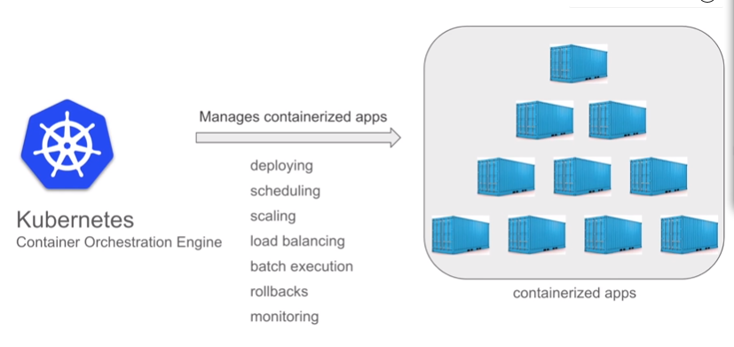
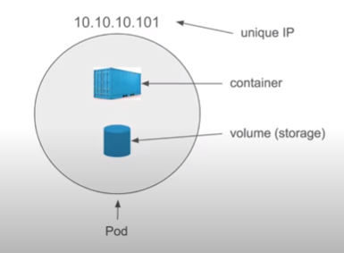

# Kubernetes 101

## Introduction

* Greek word Kubernetes - Helmsman - Orchestrator
* K8s - 8 characters between K and S in Kubernetes

### What is Kubernetes
* Container Management / Orchestration tool
* Developed by Google
* Managed by CNCF
* Open Source
* Written in Golang
 

### What is Container Orchestration Engine

* **Container Management/Orchestration Tool:** It is used to automate the deploying, scaling and management of containers or group of containers.

**CMS Tools Example:**
1. Kubernetes
2. Apache Mesos Marathon
3. Docker Swarm

**CMS Manages:**
1. Deployment
2. Scheduling
3. Scaling
4. Load Balancing

### Why Kubernetes
* Different management needs of CMS
1. Deployment
2. Scheduling
3. Scaling
4. Load Balancing
5. Batch execution
6. Rollbacks
7. Monitoring

* Organizing large number of containers

## Features of Kubernetes

### 1. Automatic Bin Packing

* Servers are also called as bins.
* We have to optimize the packing of software on servers in most efficient way.
* Automated packing and scheduling based on specified requirements and resources available.

**Pods:** Collection of containers

* Kuberenetes does not have direct communication with container
* Kubernetes wraps container or group of them in a pod.
* Pod or group of pods are stored on node.

**Nodes:** Working or Master device. Pods run on nodes.

* We can specify the reosources needed for pods and containers and these specifications are used by Kubernetes for better packing.

### 2. Service Discovery and Load Balancing

* **Pods:** Consists of
1. application container(s)
2. volumes
3. Unique IP

* **Services:** Collection of related Pods in a higher-level wrapping.
Uniquely identified by DNS name.
**Services can consist of replica of same pod which can be used for load balancing.**
Services are used for Network and communication.

### 3. Storage Orchestration**

* Volume definition inside pods.
* One volume for one pod
* Volume can be:
1. Docker volume
2. Local Storage
3. Cloud storage
4. Network Storage (NFS)

### 4. Self-Healing

**Self Healing done by Replication Controller**
* If container fails - restart container
* If node dies - replace and reschedule containers on other nodes
* If container does not respond to health check - Kill the container and use alternate container

## Architecture of Kubernetes

## Hands On
