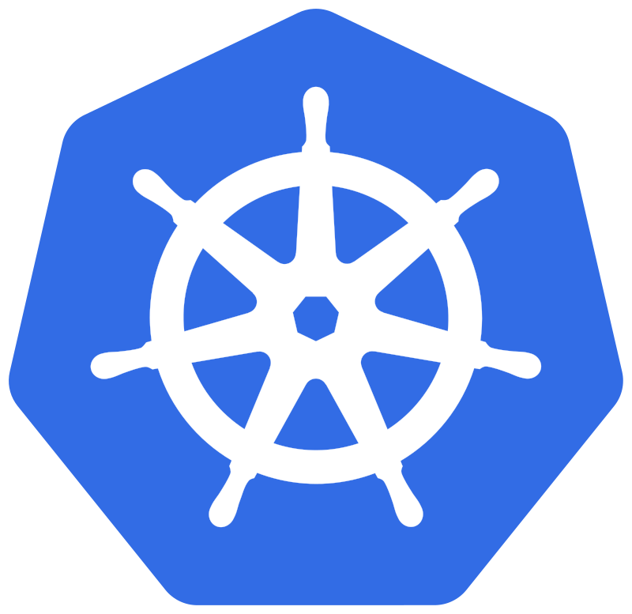

# Kubernetes

## The need for Kubernetes (or Orchestration tool in general)

For complex applications, for keeping modularity, large number of containers were needed to be managed where one container did one modular task in isolation and communicated with other via some API.
This management issue lead to the need of orchestration tool.
Kubernetes is one of the first and also the most used orchestration tool for containers developed by Google.

### Orchestration tools:

1. Kubernetes
2. Nomad
3. Docker Swarm
4. Mesos

## Features of Orchestration System

**1. Scheduling:**
* Resources per need dynamically -> optimize resource usage.
* By label -> priortize

**2. Replication:** Replication in distributed storage is needed for backup so that uptime is maximized.

**3. Handling failures:** Create alerts and feedback mechanisms for failure, downtime or resource usage above threshold.

**4. Discovery:** Since containers work in isolation and do not know about existence of other containers, orchestration tool must find the containers for communication.

**5. Inspection:** Monitor health and status of the containers.

**6. Load balancing:** Balance the load by equal distribution on all containers and scaling according to needs.

**7. Auto scaling:** Auto-scaling is a replication factor which maintains a certain number of replicas of container in the cluster.
If one or more cluster fails or goes down, another replica is created to maintain the replica factor.

